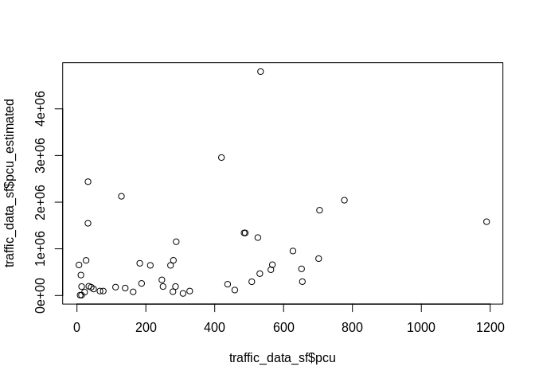
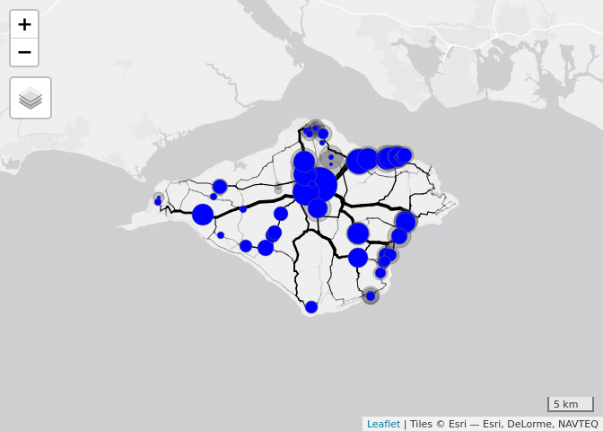
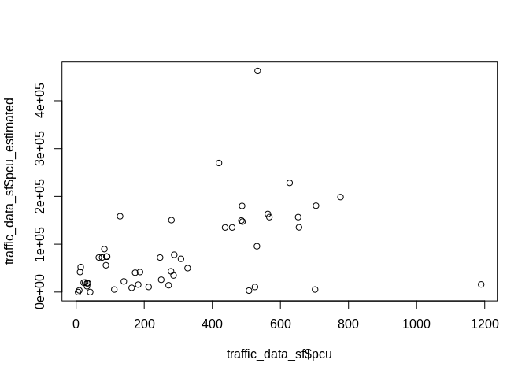

<!-- README.md is generated from README.Rmd. Please edit that file -->

# trafficEstimatr

<!-- badges: start -->

<!-- badges: end -->

The goal of trafficEstimatr is to demonstrate methods for estimating
traffic volumes down to the route segment level using open access
datasets.

The following code chunk downloads and pre-processes OpenStreetMap data
that we will use for this
purpose.

``` r
u = "http://data.dft.gov.uk/road-traffic/dft_traffic_counts_raw_counts.zip"
f = tempfile()
download.file(url = u, destfile = f)
unzip(zipfile = f, exdir = tempdir())
fd = list.files(tempdir(), pattern = "counts.csv", full.names = TRUE)
d = readr::read_csv(fd)
table(d$road_category)
table(d$road_name)
d$is_a_road = grepl(pattern = "^A", d$road_type)
table(d$road_type) / nrow(d)
da = d %>% 
  group_by(count_point_id) %>% 
  summarise(
    pcu = mean(all_motor_vehicles),
    lon = mean(longitude),
    lat = mean(latitude)
    )
di = d %>% filter(local_authority_name == "Isle of Wight")
dai = di %>% 
  group_by(count_point_id, longitude, latitude) %>% 
  summarise(
    n = n(),
    pcu = mean(all_motor_vehicles),
    lon = mean(longitude),
    lat = mean(latitude)
    ) %>% 
  ungroup()
dai %>% arrange(desc(n)) %>% slice(1:9)
dasf = sf::st_as_sf(dai, coords = c("lon", "lat"), crs = 4326)
iow_boundary = pct::pct_regions %>% filter(region_name == "isle-of-wight")
traffic_data_sf = dasf[iow_boundary, ]
tm_shape(traffic_data_sf) + tm_dots(size = "pcu")
saveRDS(traffic_data_sf, "traffic_data_sf.Rds")
sf::write_sf(traffic_data_sf, "roads_iow/traffic_data.shp")
# aim: try to estimate PCU values across IoW, if it works, try for all of UK (big data)
```

``` r
traffic_data_sf = readRDS("dasf_iow.Rds")
tm_shape(traffic_data_sf) + tm_dots(size = "pcu")
#> Linking to GEOS 3.5.1, GDAL 2.1.2, PROJ 4.9.3
#> Legend for symbol sizes not available in view mode.
```

<!-- -->

``` r
geofabric::get_geofabric(continent = "europe", country = "great-britain", region = "england")
roads_uk = sf::read_sf(file.path(tempdir(), "gis_osm_roads_free_1.shp"))
saveRDS(roads_uk, "roads_uk.Rds")
piggyback::pb_upload("roads_uk.Rds")
roads_iow = roads_uk[iow_boundary, ]
saveRDS(roads_iow, "roads_iow.Rds")
# create .shp file
dir.create("roads_iow")
sf::write_sf(roads_key, "roads_iow/roads_key.shp")
zip("roads_iow.zip", "roads_iow/")
piggyback::pb_upload("roads_iow.zip")
piggyback::pb_upload("roads_iow.Rds")
nrow(roads_iow)
mapview::mapview(roads_iow)
key_roads_text = "primary|secondary|tertiary|cycleway|trunk"
roads_key = roads_iow[grepl(pattern = key_roads_text, x = roads_iow$fclass), ]
saveRDS(roads_key, "roads_key.Rds")
mapview::mapview(roads_key)
```

``` r
library(dodgr)
roads_key = readRDS("roads_key.Rds")
rnet_dodgr = weight_streetnet(x = roads_key, type_col = "fclass")
```

### dodgr centrality

`dodgr` can calculate network centrality by aggregating unit flows from
all points to all other points. Note that centrality measured above (via
`igraph`) is taken between all pairs of all actual points within the
Open Street Map data base, but that these points themselves are sampled
at arbitrary (spatial) intensities, and in particular generally have
higher sampling densities towards the centres of dense urban regions.
The resultant measure of centrality is accordingly biased by such
effects. Removing these effects requires reducing the network down to
junctions only, and calculating centrality between all junction points,
irrespective of how many points intervene these junctions. This is what
`dodgr_contract_graph` does.

``` r
rnet_contracted = dodgr_contract_graph(rnet_dodgr)
v <- dodgr_vertices (rnet_contracted) # 500 vertices
fmat <- array (1, dim = rep (nrow (v), 2))
rnet_f <- dodgr_flows_aggregate (rnet_contracted, from = v$id, to = v$id,
                                 flows = fmat)
rnet_directed <- merge_directed_flows (rnet_f)
rnet_f = dodgr_to_sf(rnet_directed)
summary(rnet_f$flow)
#>    Min. 1st Qu.  Median    Mean 3rd Qu.    Max. 
#>       2     904    2726    6240    7730   60240
tm_shape(rnet_f) +
  tm_lines(lwd = "flow", scale = 9) +
  tm_shape(traffic_data_sf) +
  tm_dots(size = "pcu", alpha = 0.2) +
  tm_scale_bar()
#> Legend for symbol sizes not available in view mode.
#> Legend for line widths not available in view mode.
```

<!-- -->

The simple betweenness measure of centrality can explain around 10% of
the variability in observed PCU counts, as demonstrated
below:

``` r
traffic_data_buffer = stplanr::geo_projected(traffic_data_sf, st_buffer, dist = 200)
#> Registered S3 method overwritten by 'R.oo':
#>   method        from       
#>   throw.default R.methodsS3
traffic_estimates = aggregate(rnet_f["flow"], traffic_data_buffer, max) 
#> although coordinates are longitude/latitude, st_intersects assumes that they are planar
traffic_data_sf$pcu_estimated = traffic_estimates$flow
tm_shape(rnet_f) +
  tm_lines(lwd = "flow", scale = 9) +
  tm_shape(traffic_data_sf) +
  tm_dots(size = "pcu", alpha = 0.2) +
  tm_shape(traffic_data_sf) +
  tm_dots(size = "pcu_estimated", col = "blue") +
  tm_scale_bar()
#> Legend for symbol sizes not available in view mode.
#> Legend for line widths not available in view mode.
```

<!-- -->

``` r
plot(traffic_data_sf$pcu, traffic_data_sf$pcu_estimated)
```

<!-- -->

``` r
cor(traffic_data_sf$pcu, traffic_data_sf$pcu_estimated, use = "complete.obs")^2
#> [1] 0.08865354
```

The fit can be expected to be higher when using the uncontracted graph,
as shown
below:

``` r
# rnet = dodgr::dodgr_uncontract_graph(graph = rnet_directed) # fails with:
# Error in dodgr::dodgr_uncontract_graph(graph = rnet_directed) : 
#   Unable to uncontract this graph because the rows have been changed
```

``` r
# currently fails
v <- dodgr_vertices (rnet_dodgr) %>% 
  sample_n(100)
fmat <- array (1, dim = rep (nrow (v), 2))
rnet_f <- dodgr_flows_aggregate (rnet_contracted, from = v$id, to = v$id,
                                 flows = fmat)
rnet_directed <- merge_directed_flows (rnet_f)
rnet_f = dodgr_to_sf(rnet_directed)
summary(rnet_f$flow)
tm_shape(rnet_f) +
  tm_lines(lwd = "flow", scale = 9) +
  tm_shape(traffic_data_sf) +
  tm_dots(size = "pcu", alpha = 0.2) +
  tm_scale_bar()
```

## With stplanr

``` r
library(stplanr)
rnet = SpatialLinesNetwork(roads_key)
rnet@sl$flow = igraph::edge_betweenness(rnet@g)
summary(rnet@sl$flow)
#>    Min. 1st Qu.  Median    Mean 3rd Qu.    Max. 
#>       0    2488   11521   28041   35293  250933
tm_shape(rnet@sl) +
  tm_lines(lwd = "flow", scale = 9)
#> Legend for line widths not available in view mode.
```

<!-- -->

``` r
traffic_data_buffer = stplanr::geo_projected(traffic_data_sf, st_buffer, dist = 100)
traffic_estimates = aggregate(rnet@sl["flow"], traffic_data_buffer, max) 
#> although coordinates are longitude/latitude, st_intersects assumes that they are planar
traffic_data_sf$pcu_estimated = traffic_estimates$flow
tm_shape(rnet@sl) +
  tm_lines(lwd = "flow", scale = 9) +
  tm_shape(traffic_data_sf) +
  tm_dots(size = "pcu", alpha = 0.2) +
  tm_shape(traffic_data_sf) +
  tm_dots(size = "pcu_estimated", col = "blue") +
  tm_scale_bar()
#> Legend for symbol sizes not available in view mode.
#> Legend for line widths not available in view mode.
```

<!-- -->

``` r
plot(traffic_data_sf$pcu, traffic_data_sf$pcu_estimated)
```

<!-- -->

``` r
cor(traffic_data_sf$pcu, traffic_data_sf$pcu_estimated, use = "complete.obs")^2
#> [1] 0.1529621
```
