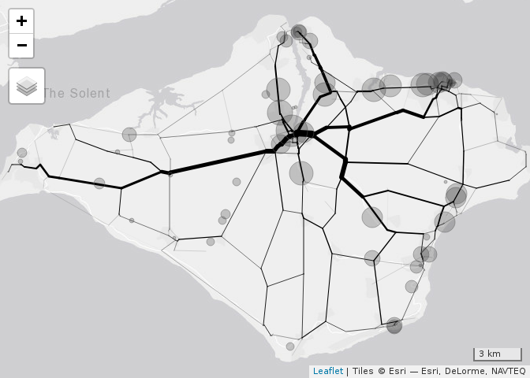

<!-- README.md is generated from README.Rmd. Please edit that file -->

# trafficEstimatr

<!-- badges: start -->

<!-- badges: end -->

The goal of trafficEstimatr is to
…

``` r
u = "http://data.dft.gov.uk/road-traffic/dft_traffic_counts_raw_counts.zip"
f = tempfile()
download.file(url = u, destfile = f)
unzip(zipfile = f, exdir = tempdir())
fd = list.files(tempdir(), pattern = "counts.csv", full.names = TRUE)
d = readr::read_csv(fd)
table(d$road_category)
table(d$road_name)
d$is_a_road = grepl(pattern = "^A", d$road_type)
table(d$road_type) / nrow(d)
da = d %>% 
  group_by(count_point_id) %>% 
  summarise(
    pcu = mean(all_motor_vehicles),
    lon = mean(longitude),
    lat = mean(latitude)
    )
di = d %>% filter(local_authority_name == "Isle of Wight")
dai = di %>% 
  group_by(count_point_id, longitude, latitude) %>% 
  summarise(
    n = n(),
    pcu = mean(all_motor_vehicles),
    lon = mean(longitude),
    lat = mean(latitude)
    ) %>% 
  ungroup()
dai %>% arrange(desc(n)) %>% slice(1:9)
dasf = sf::st_as_sf(dai, coords = c("lon", "lat"), crs = 4326)
iow_boundary = pct::pct_regions %>% filter(region_name == "isle-of-wight")
dasf_iow = dasf[iow_boundary, ]
tm_shape(dasf_iow) + tm_dots(size = "pcu")
saveRDS(dasf_iow, "dasf_iow.Rds")
# aim: try to estimate PCU values across IoW, if it works, try for all of UK (big data)
```

``` r
dasf_iow = readRDS("dasf_iow.Rds")
tm_shape(dasf_iow) + tm_dots(size = "pcu")
#> Linking to GEOS 3.5.1, GDAL 2.1.2, PROJ 4.9.3
#> Legend for symbol sizes not available in view mode.
```

<!-- -->

``` r
geofabric::get_geofabric(continent = "europe", country = "great-britain", region = "england")
roads_uk = sf::read_sf(file.path(tempdir(), "gis_osm_roads_free_1.shp"))
saveRDS(roads_uk, "roads_uk.Rds")
piggyback::pb_upload("roads_uk.Rds")
roads_iow = roads_uk[iow_boundary, ]
saveRDS(roads_iow, "roads_iow.Rds")
piggyback::pb_upload("roads_iow.Rds")
nrow(roads_iow)
mapview::mapview(roads_iow)
key_roads_text = "primary|secondary|tertiary|cycleway|trunk"
roads_key = roads_iow[grepl(pattern = key_roads_text, x = roads_iow$fclass), ]
saveRDS(roads_key, "roads_key.Rds")
mapview::mapview(roads_key)
```

``` r
library(dodgr)
roads_key = readRDS("roads_key.Rds")
rnet_dodgr = weight_streetnet(x = roads_key, type_col = "fclass")
```

### dodgr centrality

`dodgr` can calculate network centrality by aggregating unit flows from
all points to all other points. Note that centrality measured above (via
`igraph`) is taken between all pairs of all actual points within the
Open Street Map data base, but that these points themselves are sampled
at arbitrary (spatial) intensities, and in particular generally have
higher sampling densities towards the centres of dense urban regions.
The resultant measure of centrality is accordingly biased by such
effects. Removing these effects requires reducing the network down to
junctions only, and calculating centrality between all junction points,
irrespective of how many points intervene these junctions. This is what
`dodgr_contract_graph` does.

``` r
rnet_contracted = dodgr_contract_graph(rnet_dodgr)
v <- dodgr_vertices (rnet_contracted)
fmat <- array (1, dim = rep (nrow (v), 2))
rnet_f <- dodgr_flows_aggregate (rnet_contracted, from = v$id, to = v$id,
                                 flows = fmat)
rnet_f <- merge_directed_flows (rnet_f) %>% dodgr_to_sf () # slowest part
plot (rnet_f$geometry, lwd = 10 * rnet_f$flow / max (rnet_f$flow))
plot(dasf_iow, add = T)
#> Warning in plot.sf(dasf_iow, add = T): ignoring all but the first attribute
```

<!-- -->

Goodness of fit.

``` r
st_join(dasf_iow, rnet_f["flow"], op = sf::st_nearest_points)
#> although coordinates are longitude/latitude, st_intersects assumes that they are planar
#> Simple feature collection with 58 features and 5 fields
#> geometry type:  POINT
#> dimension:      XY
#> bbox:           xmin: -1.529917 ymin: 50.58385 xmax: -1.115219 ymax: 50.75773
#> epsg (SRID):    4326
#> proj4string:    +proj=longlat +datum=WGS84 +no_defs
#> # A tibble: 58 x 6
#> # Groups:   count_point_id, longitude [58]
#>    count_point_id longitude latitude    pcu             geometry  flow
#>             <dbl>     <dbl>    <dbl>  <dbl>          <POINT [°]> <dbl>
#>  1           7566     -1.28     50.8  279.  (-1.277563 50.75236)    NA
#>  2           7578     -1.30     50.6   87.6 (-1.295116 50.58385)    NA
#>  3          17546     -1.43     50.7  247.  (-1.434967 50.70071)    NA
#>  4          17547     -1.22     50.7  487.  (-1.223317 50.65525)    NA
#>  5          17850     -1.29     50.7 1190.    (-1.293332 50.703)    NA
#>  6          27619     -1.22     50.6  280.  (-1.223693 50.63241)    NA
#>  7          27633     -1.17     50.6  327.  (-1.174163 50.63477)    NA
#>  8          28156     -1.26     50.7  525.  (-1.264597 50.72945)    NA
#>  9          37656     -1.30     50.8  182.  (-1.298258 50.75249)    NA
#> 10          38210     -1.16     50.7  458.  (-1.162551 50.73037)    NA
#> # … with 48 more rows
sf::st_nearest_points(rnet_f, dasf_iow)
#> although coordinates are longitude/latitude, st_nearest_points assumes that they are planar
#> Geometry set for 37874 features 
#> geometry type:  LINESTRING
#> dimension:      XY
#> bbox:           xmin: -1.540631 ymin: 50.57891 xmax: -1.089382 ymax: 50.76237
#> epsg (SRID):    4326
#> proj4string:    +proj=longlat +datum=WGS84 +no_defs
#> First 5 geometries:
#> LINESTRING (-1.274253 50.74516, -1.277563 50.75...
#> LINESTRING (-1.274357 50.74499, -1.295116 50.58...
#> LINESTRING (-1.274357 50.74499, -1.434967 50.70...
#> LINESTRING (-1.274157 50.74497, -1.223317 50.65...
#> LINESTRING (-1.274357 50.74499, -1.293332 50.703)
```
